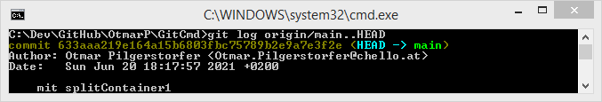

# GitCmd

Executes a git-Command for many Repositories:

Config:   
GitListe.txt | GitListe[ComputerName].txt

    1="C:\Dev\GitHub\OtmarP\GitCmd"

---

### Visual Studio - Changes
##### Visual Studio - Changes(1)

##### git status : Changes not staged for commit: ...

##### git status -s : M ...

---

### Visual Studio - Synchronization
##### Visual Studio - Synchronization - Outgoing Commits(1)

##### git ststus : Your branch is ahead of 'origin/main' by 1 commit.

##### git log origin/main..HEAD : ...

---

### Visual Studio - Synchronization
##### Visual Studio - Synchronization - Incoming Commits(3)

##### git status : Your branch is behind 'origin/main' by 3 commits.

